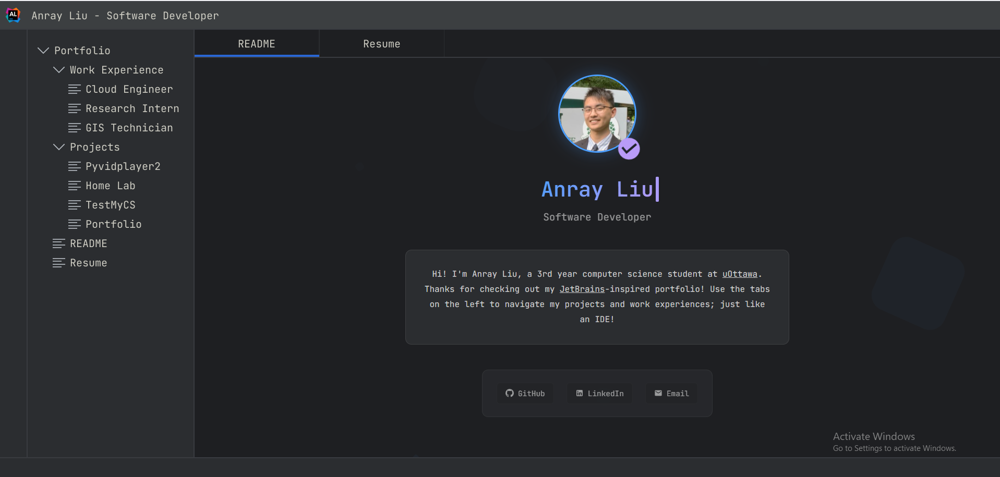

## [https://www.anrayliu.ca](https://www.anrayliu.ca)



## Run Locally (Windows)

1. Create python vm and install packages
```
python -m venv .venv 
.venv\Scripts\activate
pip install -r requirements.txt
```
2. Run `python app.py` to start flask server
3. Go to http://localhost:5001/

Alternatively, build the project with `docker compose build` and deploy it with `docker compose up`.
